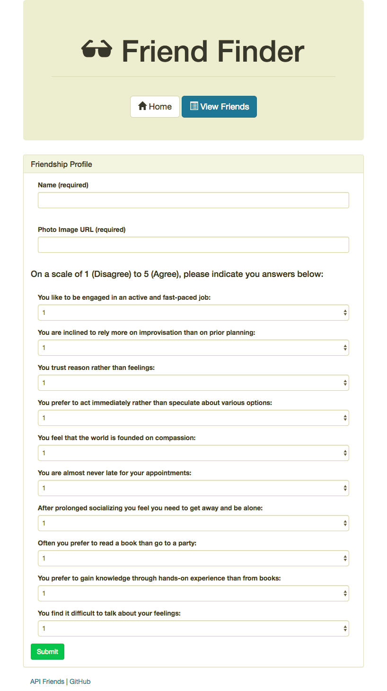

# FriendFinder

A Friend Finder app (essentially a dating app but for friends) using Node and Express servers. When the user submits their personality profile, they are matched with a "friend" that has the closest match to their personality.

## Getting Started
https://shrouded-depths-66692.herokuapp.com/

## Screen Shots

## Index Page


## Survey


## Submit and Match


## Technologies used
- Node.js
- body-parager NPM Package - https://www.npmjs.com/package/inquirer
- express NPM Package - https://www.npmjs.com/package/express
- path NPM Package - https://www.npmjs.com/package/path

### Prerequisites

```
- Node.js - Download the latest version of Node https://nodejs.org/en/
```

## Built With

* VS Code  - Text Editor

## Authors

* **Sonny Hughes** - *HTML/JS/Node.js* - [Sonny Hughes](https://github.com/sonnyhughes)